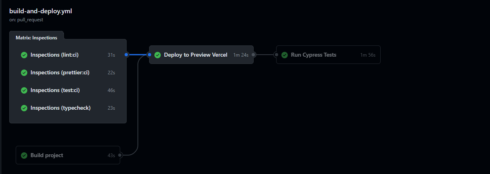
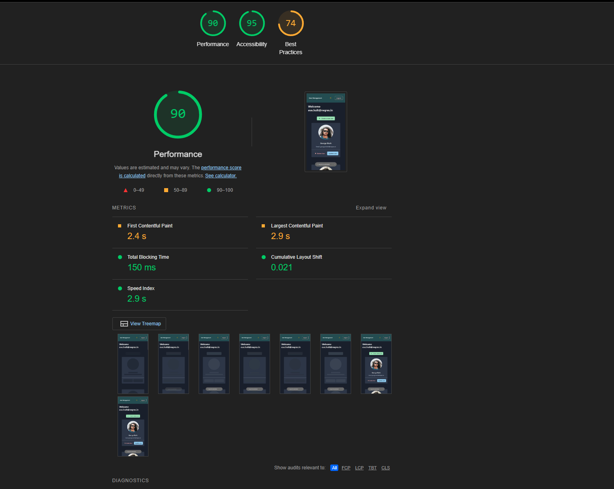

# User Management - Home Task

This is a home task for a user management system. The main goal is to create a user management system with the following features:

- Sign in
- Sign up
- Dashboard with CRUD operations
- Dark Theme
- Tests

Kanban and tasks planned [here](https://occipital-eater-a86.notion.site/d1fa98ddd34148f18bedec785d373469?v=0f9997d3f912470abc6ecccb705476ab&pvs=4)

Production URL Deployed: https://user-management-1global.vercel.app/

## Requirements

- NodeJS 21 LTS
- Docker
- yarn

## Tech Stack

- [ReactJS](https://reactjs.org)
- [React Router Dom](https://reactrouter.com/en/main)
- [Vite](https://vitejs.dev)
- [TypeScript](https://www.typescriptlang.org)
- [Jest](https://jestjs.io)
- [Testing Library](https://testing-library.com)
- [MSW](https://mswjs.io)
- [Cypress](https://www.cypress.io)
- [ESLint](https://eslint.org)
- [Prettier](https://prettier.io)
- [Polyfills](https://github.com/vitejs/vite/tree/main/packages/plugin-legacy#readme)
- [Chakra UI](https://chakra-ui.com/)
- [Docker](https://www.docker.com/)
- [Axios](https://axios-http.com/docs/intro)
- [Formik](https://formik.org/)
- [React Icons](https://react-icons.github.io/react-icons/)

## Demo

Usually, I like to record small videos and add in every PR when it's UI changes. However since this is a home task with time constraint I decided to add one video demo with everything done.


## Getting started

1. Clone the project.

   ```bash
   git clone https://github.com/adrianlemess/user-management-1global
   ```

2. Access the project directory.

   ```bash
   cd user-management-1global
   ```

3. Install dependencies.

   ```bash
   yarn
   ```

4. Start dev server with hot reload at http://localhost:3000.
   ```bash
   yarn dev
   ```

## Deploy

#### Docker file - How to Run

Build the image:

```sh
docker build -t adrianlemess/user-management .
```

Run the image in the port 8080 (First value in the -p parameter):

```sh
docker run -d -p 8080:80 adrianlemess/user-management
```

Check if the image is running properly:

```sh
docker ps
```

Stop the image if necessary

```sh
docker stop -t=0 id_image
```

## Testing

### Trophy test approach

My test strategy was based in the [Trophy test approach by Kent Dodds](https://kentcdodds.com/blog/the-testing-trophy-and-testing-classifications)

That's why I also pick testing library to create the integration tests.

### E2E test structure

- Config: It contains the URL to test, as well as the page objects with user information for signing in and signing up.
- Tests:
  - SignIn: E2E tests for the SignIn functionality.
  - SignUp: E2E tests for the SignUp functionality.
  - Dashboard: E2E tests for the Dashboard functionality.
  - Smoke tests: These tests navigate through the interface, clicking buttons, checking the Dark Theme toggle, signing in, signing up, and more.
- Selectors: These are the selectors for the elements being tested.
- Commands: Reusable test code. I added the Sign In (`Cy.signin()`) here since it's a requirement for all specs in the Dashboard.

### Scripts to run

| Description                                | Command                    |
| ------------------------------------------ | -------------------------- |
| Run unit / integration tests and watch     | `yarn test`                |
| Run unit / integration tests with coverage | `yarn test:coverage`       |
| Run e2e tests local                        | `yarn test:e2e`            |
| Run e2e tests in CI (Chrome)               | `yarn test:e2e:ci:chrome`  |
| Run e2e tests in CI (Firefox)              | `yarn test:e2e:ci:firefox` |

## Considerations

### CI

Ci wasn't a requirement, however I though would be a good way to show snapshots of my progress (I talk about more that in the next section). Also, I like to explore some Ops areas, specially CI, docker and deploy of apps, so was a good way to demonstrate this.



- Job Inspections: I run project validations in parallel like type check, lint, prettier and integration / unit tests with jest and testing library
- Build: creates the artifact to be deployed
- Deploy in Vercel: deploy a preview environment and also comment in the PR with the preview URL
- E2E with cypress: Once I have the preview URL deployed I run the E2E tests on Chrome

Production

- I have another pipeline way simple just to deploy in production once the PR is merged on `main`.

### PRs Story and Preview URLs

I organized my PRs into phases, but things got a bit mixed up in the end. Once Phase 1 was completed, which included the Sign In and Sign Up pages, I began working on the `Dark Theme` (Phase 3) and E2E tests (Phase 4) for those screens.

This early work significantly streamlined my efforts when developing the dashboard later on, with tests and dark theme setup already done.

The initial structure of the repo, as well as the CI configuration, was directly committed to the `main` branch. You can see the task details [here](https://www.notion.so/Initial-structure-8d959b3c80664760a298b9d5e76f85e9?pvs=4).

After setting up the deployment and obtaining a preview URL, I opened a PR for each phase outlined in the `Kanban`. This approach allowed everyone to track the progress made in each PR through micro commits and preview the state of the application at various stages via the Preview URL.

Additionally, the preview URL would be an invaluable resource for daily reviews, enabling us to check our PRs before merging them into the `main` branch and quickly gather feedback.

Check out the merged PRs [here](https://github.com/adrianlemess/user-management-1global/pulls?q=is%3Apr+is%3Aclosed)

### PRs size

All the PRs could be smaller, but since I am working alone, I took the freedom to have bigger PRs.

Also, my intention was just to show the snapshots based on the phases that I organized in the [Kanban](https://occipital-eater-a86.notion.site/d1fa98ddd34148f18bedec785d373469?v=0f9997d3f912470abc6ecccb705476ab&pvs=4) to better tell the story throughout this week of work.

### Git Squash

It was a possible improvement for me to do, but I forgot to select "squash" for the PR a few times. Also, I tried to force the squash, but I think it's an enterprise feature only.

### Responsiveness

I considered the following sizes:

- Mobile
- Ipad mini
- Ipad pro
- Web

### Browsers

I considered and tested the following browsers:

- Chrome
- Safari
- Firefox
- Edge (Chromium Based)

### State management algorithm

Unfortunately, it was taking too much time to manage the state, handle multiple API requests (Delete, Create, Update) and have the diff of the users per page of the pagination.

So, what I did was pull all the data at once and then manipulate the state in memory. It's far from an ideal solution, though.

### Dashboard with email instead of first_name

This section is related to the PR [Phase 1: Signin signup flow finished, form validations and API layer](https://github.com/adrianlemess/user-management-1global/pull/4).

Since during the Sign in process there is no ID returned from the /login API, there is no way to get the user's first_name other than calling the whole list and interacting with it. Since the dashboard is something I was planning to change with the user management view later, I decided to simplify:

- If signed in, show "Welcome <email>."
- If signed up, show "Welcome <first_name>."

### Axios Interceptor

The Axios interceptor is responsible for a few things:

1. Setting the base URL based on the .env and .env.production files, which is useful if we have one service for each environment.
2. Adding a valid token to the Authorization header of every request (except requests /register and /login).
   - You can check the /users request in the network as soon as the Dashboard is loaded.
3. Redirecting to the SignIn page if there is no token saved in localStorage.


### Delayed Requests

To be able to see the loading state in the Dashboard, I added a 2-second delay to the GET /users request. You can check it in the network tab.

### env Files

This project supports .env and .env.production files, so you can have different environments with different configurations.

### Performance improvements

1. Lighthouse

I run the lighthouse to check how was the app running. There were a few stuff I could improve here for sure.



2. Vendor split

In vite.config.ts I add a manual chunk function to split the vendors. I couldn't split the things related with Chakra-ui due some bugs I was facing after building the app.

Before this improvement:


After this improvement:


3. Lazy loading

I've added lazy loading for the 3 main routes. Considering that sometimes the entrypoint might be the dashboard (if there is a user session) or the sign up, I decided to add in the 3 main components.

## Future Improvements

- Security
  - Implement a BFF service in NodeJS to encrypt passwords, as they are currently send in the network in plain text.
  - Implement a BFF service to add tokens in cookies instead of storing them in localStorage, as it is not considered a good practice.
- Add test coverage validation in the CI pipeline with a minimum threshold.
- Improve the mobile experience in the dashboard, especially the pagination. Consider implementing infinite scroll.
- Enhance the layout of the pagination component. Keep it simple, but make it visually appealing.
- Add more tests scenarios for both unit/integration tests and e2e

## Other commands

| Description      | Command                 |
| ---------------- | ----------------------- |
| Lint             | `yarn lint`             |
| Prettier         | `yarn format`           |
| Build            | `yarn build`            |
| Serve            | `yarn serve`            |
| Type Check       | `yarn typecheck`        |
| Analyze Network  | `yarn analyze:network`  |
| Analyze Sunburst | `yarn analyze:sunburst` |
| Analyze Tree     | `yarn analyze:tree`     |

## License

This project is licensed under the [MIT License](./LICENSE).
